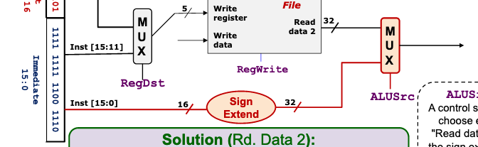

# MIPS sign extend

We expect a 32-bit number in Read Data 2 (RD2) register.



To do so, we need to extend our 16-bit input.

We want to preserve the sign, so we need to fill the remaining bits with the MSB.

E.g.

```
50  = 0000 0000 0011 0010
-50 = 1111 1111 1100 1110

-- Sign extend to 32 bits

-50 = 1111 1111 1111 1111
    = 1111 1111 1100 1110
    
50 = 0000 0000 0000 0000
   = 0000 0000 0011 0010
```
