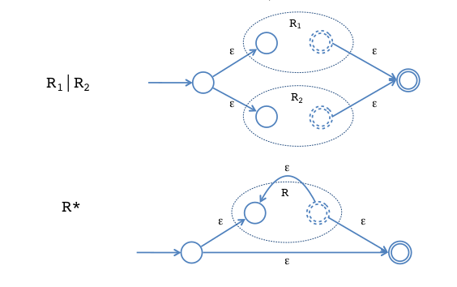

# lexers / lexing

Lexers: Generates program units.

<bd0a9abb>

## How to recover trace during errors?

Source-code position of the character can be stored in lexer for error reflection.

## Why do some regular expressions take exponential time?

Backtracking occurs due to choice regex:
```
R1 | R2
```

If we write bad regexes:
```
('a'+) 'b' | ('a'+) 'c' | ('a'+) d
```

Instead of:
```
('a'+) ('b'|'c'|'d')
```

We would backtrack a lot more.

We can reduce SAT to:
Recognizing a string by regex

Hence regex is in same class.
We can do it the other way round as well.

Hence regex is npcomplete.

## How to tiebreak?

Regular expressions are ambiguous:
Given the string "ifx = 0"

We could parse it has:
```
| if | x | = | 0 |
```

Or:
```
| ifx | = | 0 |
```

Give some matches higher priority.

## What solutions for lexing exist?

- Use Ocamllex
  Generates <86cf400c> 

## Lexing to Finite automata (DFA)

state is regex we are matching
transition is successfully matching the regex.

## Lexing to NFA

transition forks for `choice`, because there could be multiple ways to match.


```
ab* | ba*(ab)?
```

## RE to NFA



## NFA to DFA conversion

Run all executions of NFA in parallel.
Keep track of possible states: "finite fingers"

## Context-Free Grammars

Needed for describing nested chain structure / syntactic structure.
e.g. if else, balanced paranthesis etc...

https://www.geeksforgeeks.org/regular-expression-vs-context-free-grammar/

Check a phrase is part of our language.
See if language rules can produce the phrase.

parse tree is concrete syntax structure
ast abstracts unneeded info, preserving structure of syntax.
