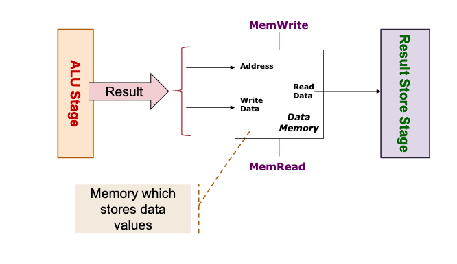

# MIPS memory access / MEM Stage

## Block diagram

## Requirements

- Only [[c3192cca]]  and [[58f67652]] perform operations here.

  Using memory address calculated by ALU Stage, Read / Write to data memory.

- Other instructions
  
  Passed through to be used in Result store stage if applicable.
  
## Input from previous stage [[c7317dfc]] 

Result to be used as memory address (if applicable)

## Output to next stage [[4f973a42]] 

Result to be stored (if applicable).

## Components

[[84c83c0c]]

## Examples

[[abf85c20]]

[[e0a1b07d]]
