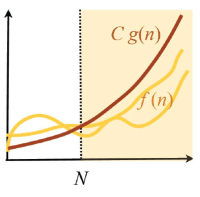

Let f(n), g(n) be positively valued functions

we say that f(n) is a subset of O(g(n))

if there exist constants N > 0, C > 0 for all n > N,

f(n) <= Cg(n)

It is written **informally** as f(n) = O(g(n))

