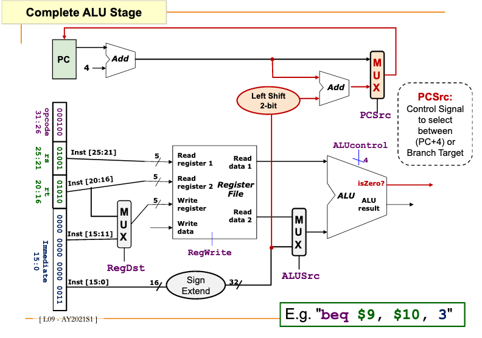

# MIPS ALU: handling branch instructions

1. Use 1-bit "isZero" to handle the eq check for branch condition.

  subtract $9, $10, check if result is zero.

2. Target address requires:
 
  PC     (Fetch stage)

  Offset (Decode stage)
