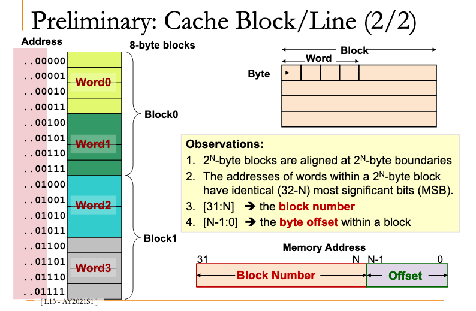
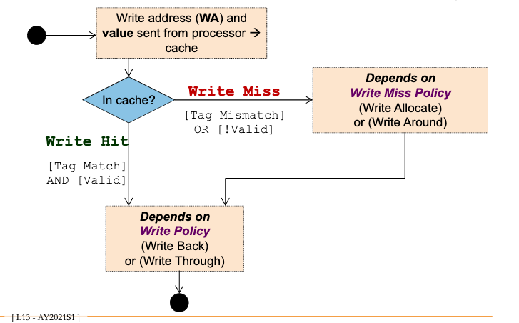

# Cache block / line

Block size is more than 1 word

Why?

Spatial locality.

Bring in bigger block -> Bring in surrounding contexts

## Observations

## Finding byte blocks

E.g. Blocks are 8-bytes / 2-words

Which block is byte #13 in?

13 `floorDiv` 2^3 = 1

You can also do [[5bfdfa36]]  the exponent

1101 sll 3 = 1

## Problems

Read miss:

data loaded into cache, load from there into register

Write miss:

[[5f3b023e]]

[[7854e8f1]]

## Summary

