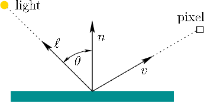

*A lambertian object* obeys *Lambert's cosine law*.

> Color of a surface is proportional to the cosine of the angle between surface normal and direction to light source

```
c ∝ cos θ 
```




Observations:
- If a surface points away from light, it should receive no light.
- Smaller angles -> higher chance that light is reflected back
- Larger angles -> reflection light gets weaker, it is likely shadowed/masked
- No dependence on camera angle


References:
[Tutorials Point](https://www.youtube.com/watch?v=V6NzwqIWRvk)
