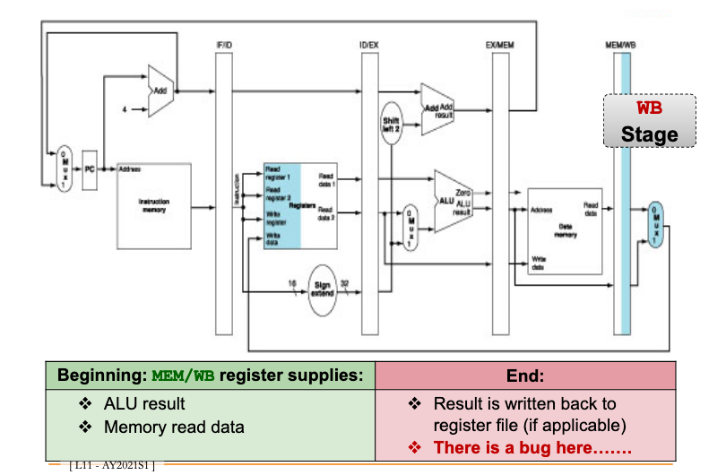
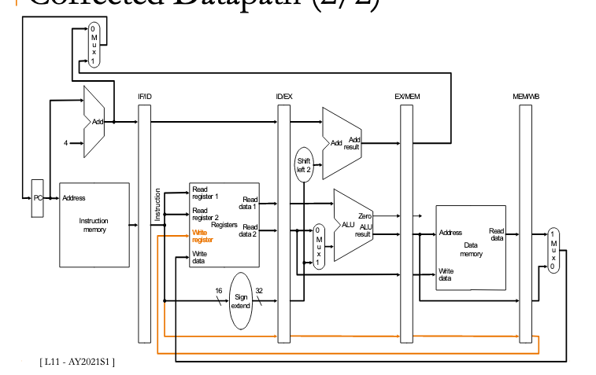

# MIPS pipeline end

*Incorrect wiring*



## Write register

The write register is the one supplied by the IF/ID pipeline register.

This is incorrect, since the instruction is now in the WB stage.

To be explicit, suppose we executed the following 2 commands in sequence:

```
add $1 $2 $3 # command 1
add $4 $5 $6 # command 2
```

When command 1 reaches the WB stage, Command 2 has updated the <221cd528> with its write register, `$4`.

`$2 + $3` gets written to `$4` instead of `$1`.

## Solution



To fix this, we pass `$1` along the pipeline registers, to `MEM/WB`.

Then, we populate `Write register` via `MEM/WB` instead of `IF/ID`, since it can overlap with the next instructions.
