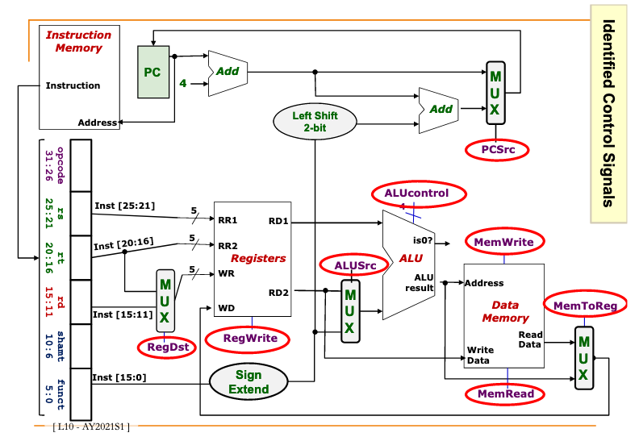

# Processor Control

## Where are the control signals?

## Types of control signals

| Control Signal | Execution Stage                       | Purpose                                            |
|----------------|---------------------------------------|----------------------------------------------------|
| <cb0fbc9f>     | Decode / Operand fetch                | Select the destination register number             |
| <0e858a92>     | Decode / Operand fetch / Result Write | Enable writing  of <d5eed474>                      |
| <5598bcf9>     | ALU                                   | Select 2nd operand for <c7317dfc>                  |
| <e7af02d2>     | ALU                                   | Select the operation to be performed               |
| <113f60fb>     | Memory                                | Enable READ/WRITE of <84c83c0c>                    |
| <79360658>     | Result Write                          | Select the result to be written back to <d5eed474> |
| <236e1780>     | Memory / Result Write                 | Select the next PC value. <c170a1b4>         |

## Generating control signals

Control signals are generated based on instruction to be executed:

- <4958e2bb>  gives us `instruction format`.

- <789029fb>  has additional information:

  The 6-bit `funct` (function code, Inst[5:0] field)
  

Idea:

- Design a <3234bb7f> 
