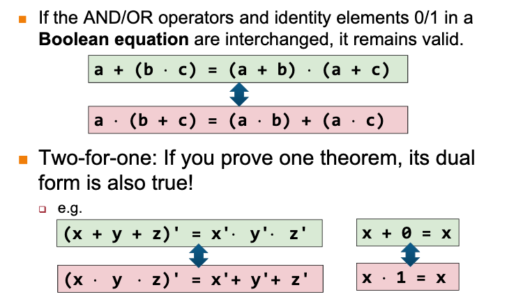

# Boolean algebra

| Law             | Equation                                             |
|-----------------|------------------------------------------------------|
| Annulment       | A ^ 0 = 0, A v 1 = 1                                 |
| Identity        | A ^ 1 = A, A v 0 = A                                 |
| Idempotent      | A v A = A, A ^ A = A                                 |
| Complement      | A v A' = 1, A ^ A' = 0                               |
| Double Negation | (A')' = A                                            |
| De Morgan's     | (A ^ B)' = A' v B', (A v B)' = A' ^ B'               |
| Associative     | (A v B) v C = A v (B v C), (A ^ B) ^ C = A ^ (B ^ C) |
| Commutative     | A v B = B v A, A ^ B = B ^ A                         |
| Distributive    | A ^ (B v C) = (A ^ B) v (A ^ C)                      |
| Absorptive      | A v (A^B) = A, A ^ (A v B) = A                       |
| Consensus       | AB v A'C v BC = AB v A'C                             |
| Consensus       | (A+B).(A'+C).(B+C) = (A+B).(A'+C)                    |

<5f7916fb>

<de1bbb34>

# Obeys duality

