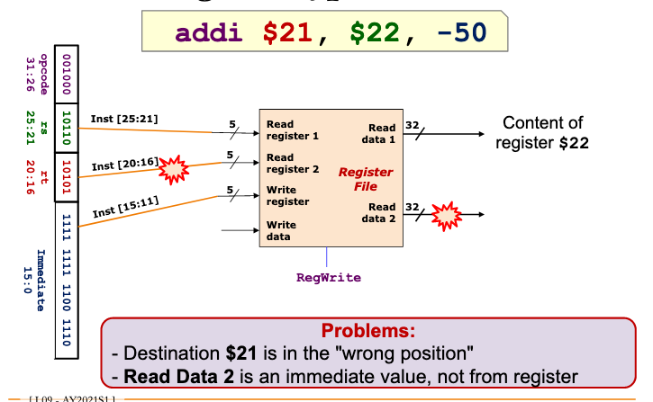
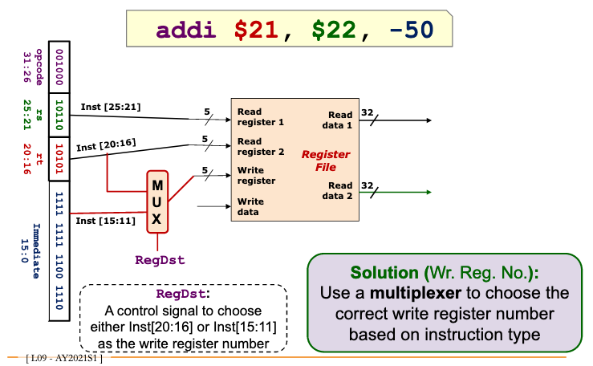
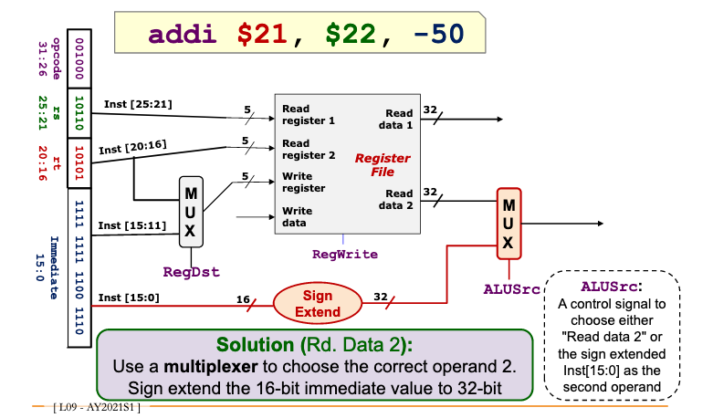

# MIPS decode i-type instruction 

## Naive decoding

rs = $22

rt = $21

immediate = -50

## Why is there a problem?

We attempt to read from rt, register $21, however it does not contain any value.

The write register is tagged to 15:0 where the immediate value resides as well.

Instead, we want to read from `immediate`.

## Solution

Switch between 20-16 and 15-11, for writing values.

Use a <d24a1eae> to perform the switching.

As you can see above, we also need to perform <0138c342>  when we use an intermediate 16-bit value.
