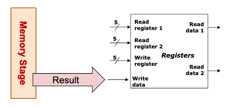
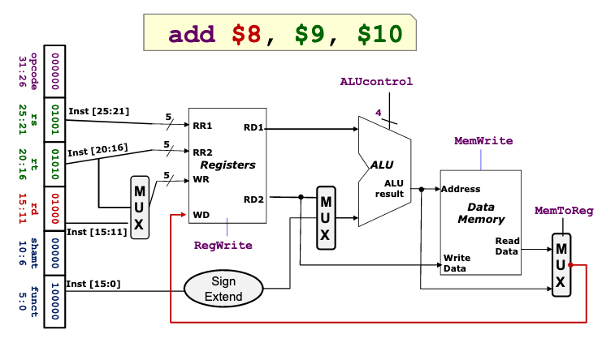

# MIPS result write

- Route correct result -> register file

- Write register number is generated in the <5fc9a159> stage.

The following routing occurs:

## Overview

Store the result of the operation.

## Usage

Most instructions write the result of some computation into a register.

Exceptions are <58f67652> , branch instructions, jump instructions.

## Input

We get the result of computations which happen in <84c83c0c>  or <c7317dfc> 
