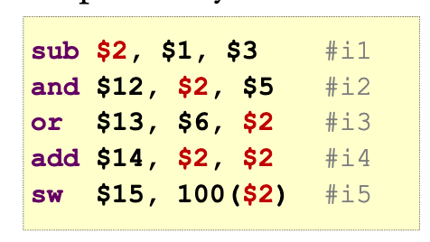

# MIPS pipeline: data hazards / data dependency

Data dependencies between instructions

Different instructions READ/WRITE the same register

Register contention

## Read After Write (RAW)

Later instructions read from destination register written by an earlier instruction 

### Example - Incorrect execution

```
i1: add $1, $2, $3
i2: sub $4, $1, $5
```

If i2 reads register $1 before i1 can write back the result,

i2 will get a stale result (old result).

### Example - illustration



Given the above instructions repeating usage of register $2, which instructions do we need to handle?


We observe the following:

- result from sub instruction is produced after EX stage.

- Data is needed by the "and/or" instructions at the beginning of EX stage

Solution:

- Forward the result to instructions, before the READ/WRITE stage, as soon as it is available.

- Replace the data read from register file.


## Other dependencies

These do not cause pipeline hazards:

- Write after Read (WAR)

- WAW (Write after Write)
