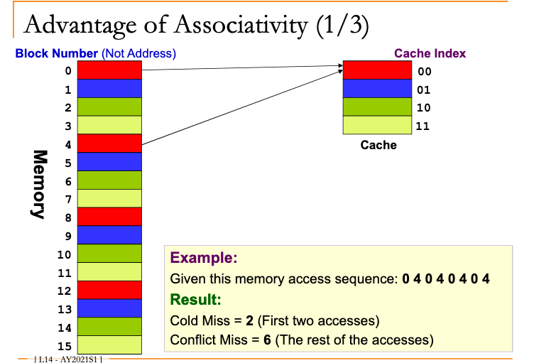
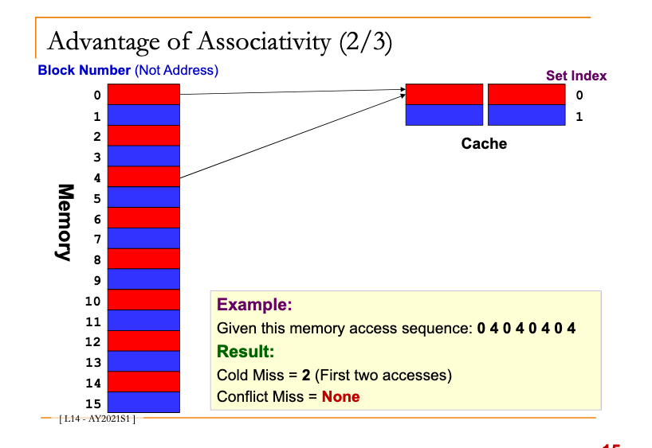
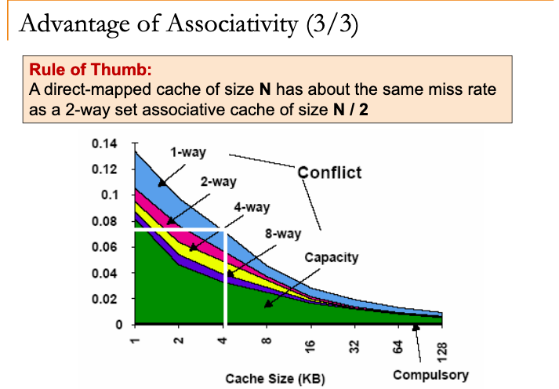
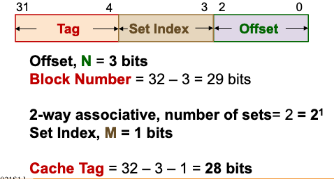
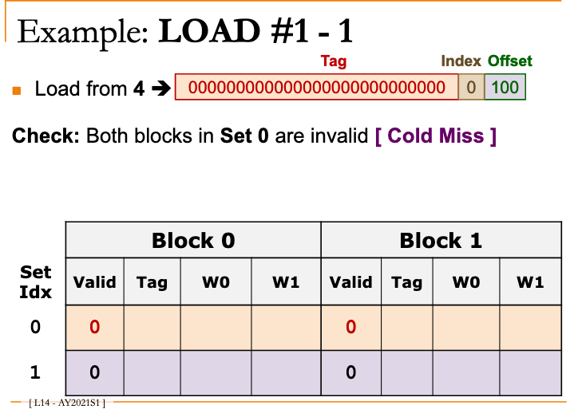
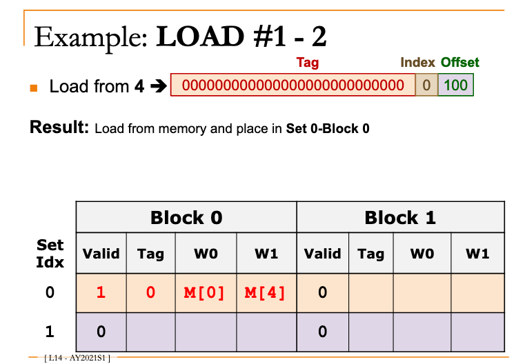
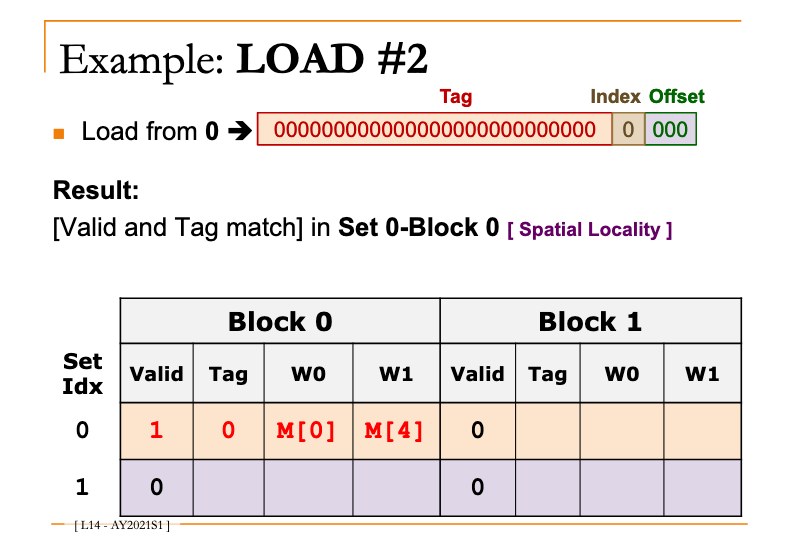
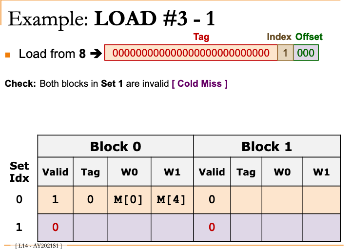
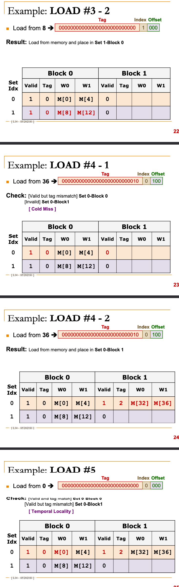

# MIPS: Advantage of associative caching

Takes advantage of <583cf010> 

## Examples

## Loading examples

Memory access sequence: 4, 0, 8, 36, 0

2-way set-associative cache with a total of 4 8-byte blocks -> total of 2 sets

Indicate hit/miss for each access

