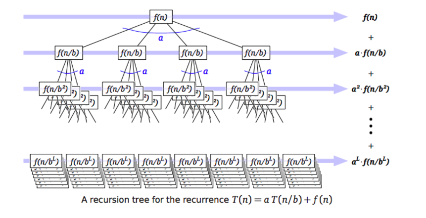

# Recursion trees

### Patterns

Most divide & conquer algorithms give us run time recurrences:

$$
T(n) = a T(n/b) + f(n)
$$

### Assumptions

`a` and `b` are integers.

Also assume:

$$
T(1) = \Theta(1), \ \textbf{and} \ f(1) = \Theta(1)
$$

### Unfolding the recursion tree

$$\begin{split}
T(n) &= a · T(n/b) + f(n)
     &= a · (a · T(n/b^2) + f(n/b)) + f(n)
     &= a^2 · T(n/b^2) + a · f(n/b) + f(n) 
\end{split}$$

Gives us:

$$\begin{split}
T(n) &= a^{L+1}T(1) + \sum_{i=0}^{L} a^i f(n/b^i) \\
     &= \Theta(\sum_{i = 0}^{L} a^i f(n/b^i))
\end{split}$$
