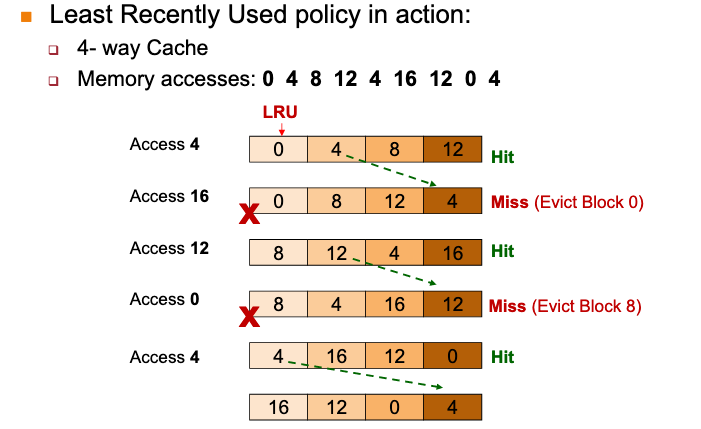

# MIPS least recently used (LRU)

For cache hit, record the cache block that was accessed.

Choose one which has not been accessed for the longest time.

(Temporal locality)

## Drawback

Hard to keep track if there are many choices
