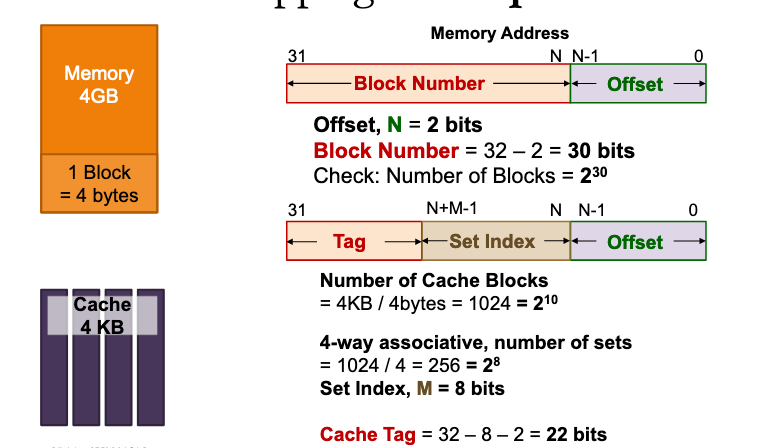

# Cache set index for associative caches

Cache set index = (BlockNumber) mod (NumberOfCacheSets)

Cache Block size = 2^N bytes
Number of cache sets = 2^M

Offset = N bits

Set Index = M bits

Tag = 32 - (N+M) bits

# Example

