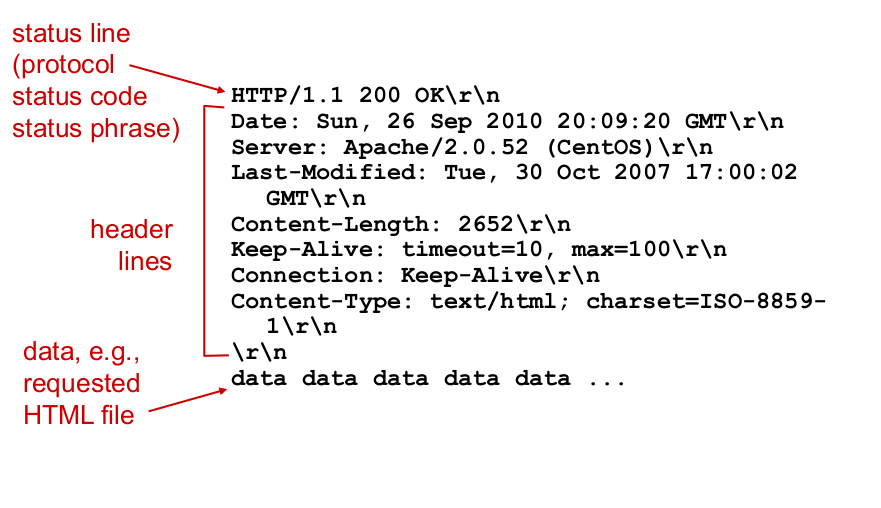

# http

uses [[6412886d]] 

- client initiates TCP connection (creates socket) to server, port 80
- server accepts TCP connection from client
- http messages exchanged between browser & web server
- tcp connection closed
- server maintains no info about past client request (as part of http protocol)

## types

### non-persistent http

at most 1 object sent over TCP, connection then closed. Downloading multiple object required multiple connections.

### persistent http

multiple objects can be sent over a single tcp connection between client, server

## Structure

- status line
- headers
- data

[[952a2566]]
