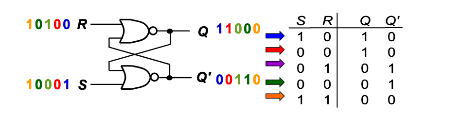

# S-R Latch

Two inputs: [S and R]

Two complementary outputs: [Q and Q']

When Q = High -> latch is in SET state

When Q = LOW -> latch is in RESET state

- Two variants:

  Active high input S-R Latch (active = 1)
  
  Active low input S-R Latch (active = 0)
  

Used in <dd46c688> 

## Shortcomings

Solution: <e92dfb94> 
