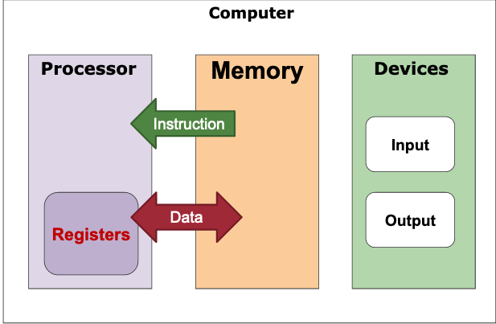
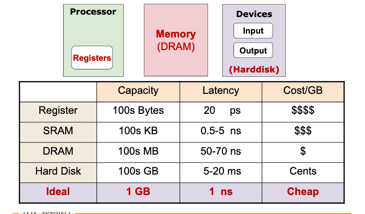
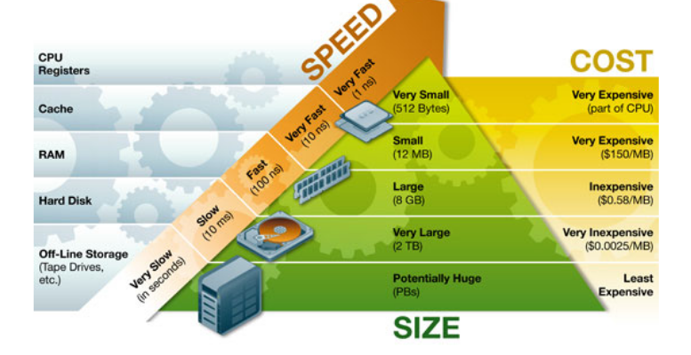
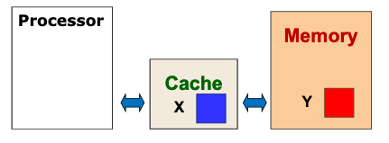
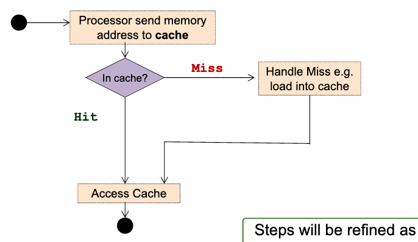
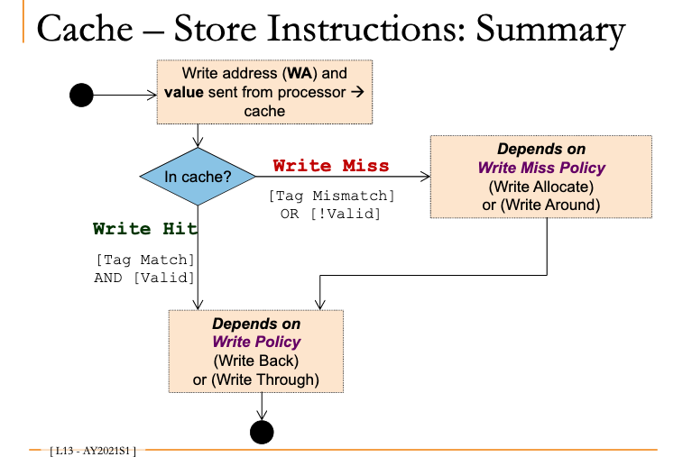

# MIPS Cache: Memory hierarchy

## Volatility

<39ef11e0>

<9f653379>

## Technologies

<01357bfa>

<9dc0d627>

<ff362a39>

*Comparison of different types of memory*

## Requirements

- Big
- Fast
- Value

Use a hierarchy of memory technologies:

- Small but fast memory near CPU

- Large but slow memory further away from CPU

## Solution

Keep the <fd59a890>  and <75aa390d> data in **smaller but faster** memory.

Refer to **bigger and slower** memory when you cannot find data/instruction in the faster memory.

This works due to <fd6291b6> 

## Implementation

Processor checks if data is in cache.

<0664d306> , (for `X`) data is returned to processor from cache. (ideal)

<a5a0e21b>, (for `Y`) data is loaded from memory. Takes more time. Data placed in cache for future reference (see <d7db7333> )

*steps*

## Components

<0b1b07fb>

## Summary

