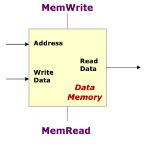

# MIPS data memory

Storage element for data of a program. Similar to <50ca8d59> 

## Inputs

- Memory address

- Data to be written (Write Data) for <58f67652> 

## Control

- Read / Write controls (only permit either one at a point in time).

## Output

- Data read from memory (Read Data) for <c3192cca> 
