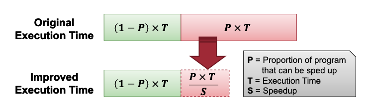
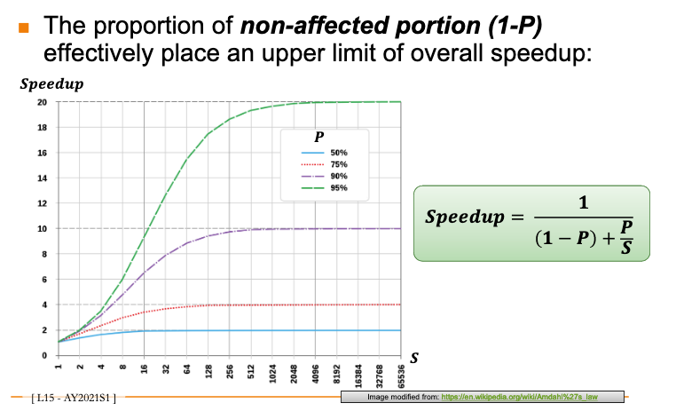

# Amdahl's Law

## What is it?

Performance is limited to the non-speedup portion of the program

**Graph**

## Why is it useful?

Suppose a program runs in 100 seconds on a machine.

- Multiply operations responsible for 80 seconds.

How much do we have to improve the speed of multiplication to get a 4x speedup?

Multiplication needs to improve 16x to become 5s.

Note that 20s is not improved however, only multplication is improved.

5 times faster -> impossible no matter how fast we improve our system.

20 + X, X always > 0.

