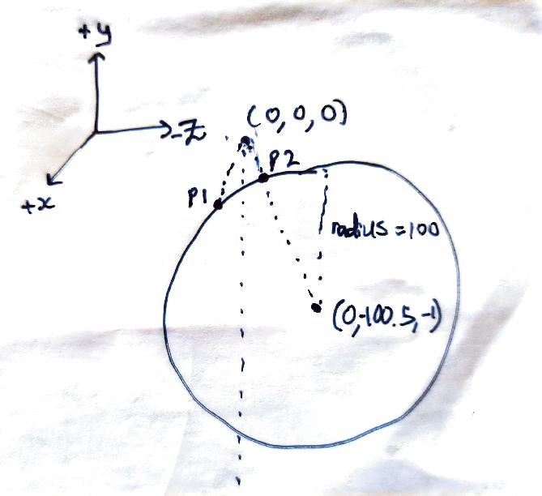
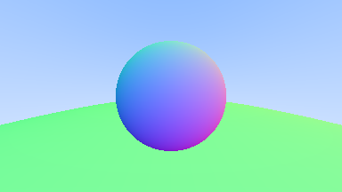

I encountered an issue when building a raytracer following [Raytracing in a weekend](https://raytracing.github.io/books/RayTracingInOneWeekend.html).

This was because I modified the code architecture.

It happened when I added a large circle at `(0, -100.5, -1)` of radius `100`.

This was the image I got:

The following diagram explains the bug:

In the negative direction (towards `P1`), the rays are incident on the circle as well.
Hence, it appears that the rays are incident on the screen when in fact they are not.

The workaround is to only accept rays with a `negative z` component.

Fixed image:

