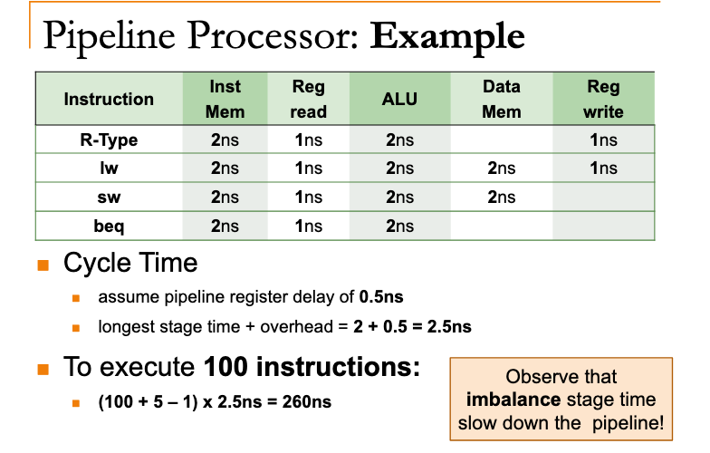
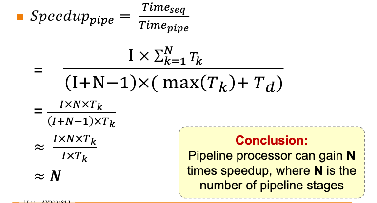

# MIPS pipelining performance

## Cycle Time 

longest stage time + pipeline overhead (from register)

## Cycles needed for I instructions

I + N - 1

(N - 1) is the cycles for filling up the pipeline

## Total time needed for I instructions

cycles * cycle time

## Example

## Ideal speedup

Every stage takes same amt of time,

no pipeline overhead,

no. of instructions is much larger than number of stages, N.

