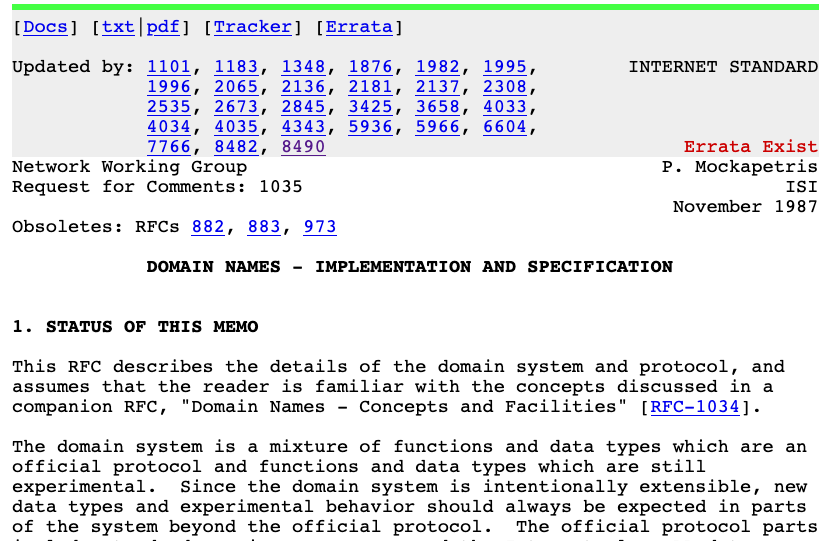

RFC is short for "Request for Comments".

It originated during APRANET.

Not all RFCs are internet standards, they have some status tags to indicate their purpose.

*An RFC tagged as internet standards*
