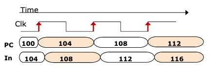

# How does MIPS handle the program counter (PC)?

| [[ab3a5749]]   | PC operation      |
|--------------|-------------------|
| 1st half     | READ              |
| Rising clock | UPDATE -> PC += 4 |

Observe at up arrow (next rising clock edge), the value of PC becomes (PC + 4).
