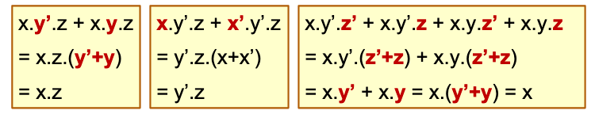

# Karnaugh-Map (K-Map)

## Observations

Abstract the common parts.

Place minterms in a special arrangement so that simplifications can be easily performed.

## Steps

1. For each '1' in the K-Map, draw the largest possible group (2, 4, 8)

2. Using (1), take all groups that cover unique '1's

3. For any remaining '1's (not covered by groups in (2)):

  Choose the smallest collection of groups to cover all of them.

## N-var kmaps

[[fb52ed57]]

[[ffe0ffff]]

[[a7309c33]]

[[9ca92c6f]]

[[697b42b0]]

## Finding POS

Find SOP for F'

Negate (1) to get POS.

