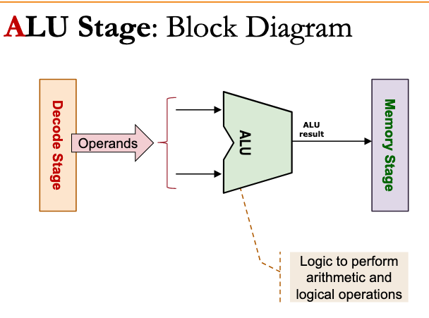
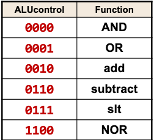

# MIPS Arithmetic-logical unit (ALU) / EX Stage

## Usage

implement arithmetic, logical operations.

## Inputs

2 x 32-bit numbers

## Control

4-bit to decide operation

## Outputs

Result of arithmetic / logical operation.

1-bit signal to indicate result is zero.

## Examples

<f2cefe04>

<21c94734>
