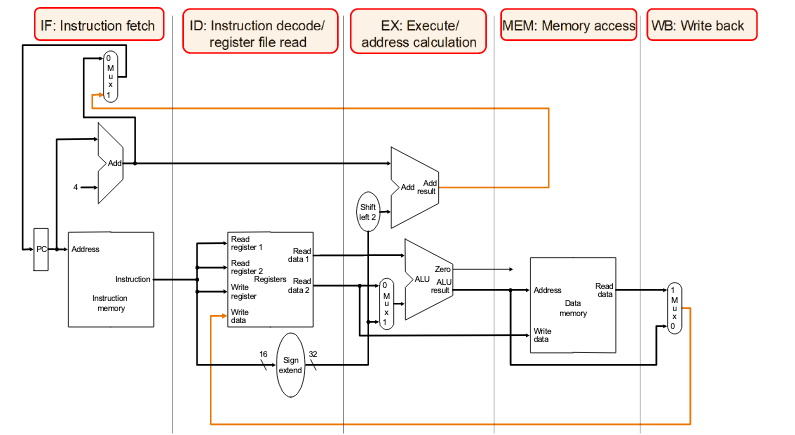
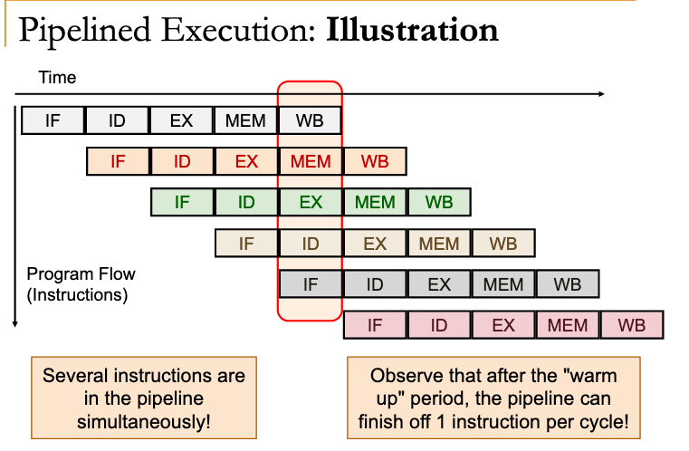

# MIPS instruction pipelining

Break up instructions into execution steps: `1 per clock cycle`.

Allow instructions to be in different execution steps simultaneously.

## Execution stages

1. IF - [[ded5c828]] 
2. ID - [[5fc9a159]] + [[8eed124e]] 
3. EX - [[c7317dfc]] 
4. MEM - [[185c1066]] 
5. WB - [[4f973a42]] 

**Each execution stage takes 1 clock cycle**

## Data flow

Generally from one stage to next.

### Exceptions

- Update of PC - [[c170a1b4]] 

- Write back of register file (WB)

## Optimization

## Managing state

### State used by subsequent instructions

Store in programmer-visible state elements: PC, register file & memory.

### State used by same instruction

We use additional registers to manage these. ([[dd46c688]])

### Pipeline control

We still require some way to manage [[36d3e38e]] .

[[f60022e7]]

### Performance

[[9ec60452]]
