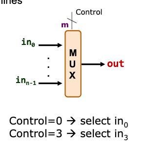

# MIPS multiplexer

Selects one input from multiple inputs. Similar to array indexing

## Inputs

n lines of same bit-width.

## Control

m bits where n = 2^m

## Ouput

control = i => select ith line.
