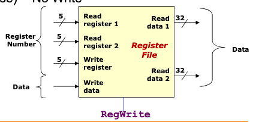

# MIPS register file



## Definition

32 x 32-bit registers.

## Operations

READ / WRITE to registers by specifying register number.

READ at most 2 registers per instruction.

WRITE at most one register per instruction.

## RegWrite - [[9d9c2970]] 

```
1 = Write
0 = No Write
```
