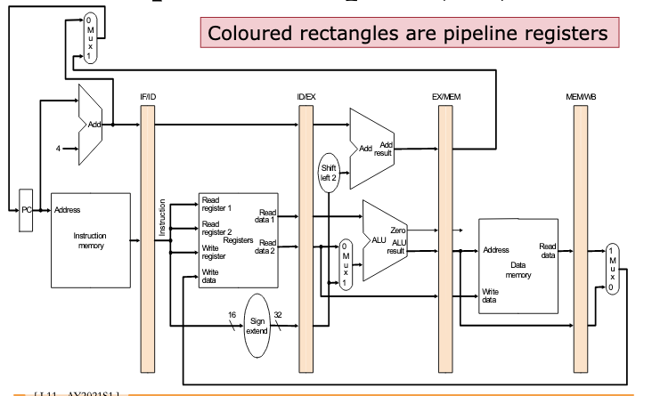

# MIPS pipeline registers

In between execution stages.

<221cd528>

<c47ff4a7>

<b80a8e8d>

<29825eab>

<35a3c588>

There is no register at the end of the WB stage, since we write back to <d5eed474> , not a pipeline register.
