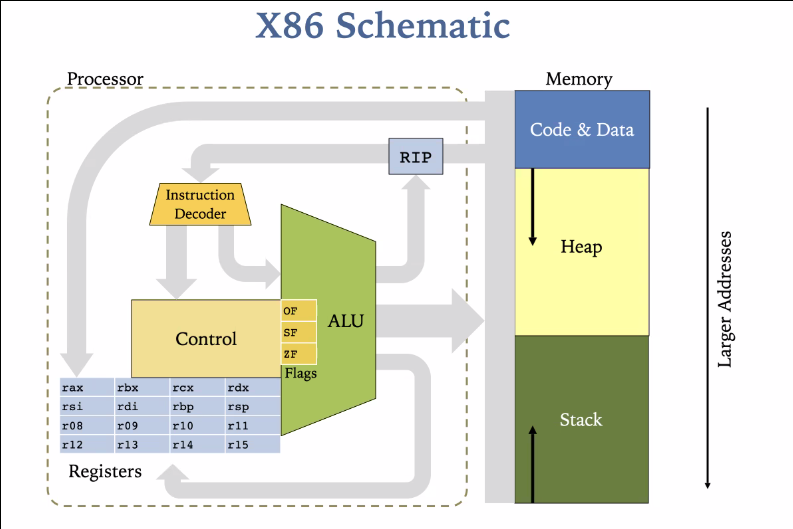

# YSC4230 Lecture 2 x86Lite

Tradeoffs - more cmds easier to specialize and optimize, less cmds easier to understand and use

X86Lite ~ 20 instructions



Writing to register is better than writing to memory.

Stores results of last executed operation:
OF integer overflow,
SF, was last result positive or negative?
ZF, zero or not

## inst

`mov` instruction
```
movq SRC, DEST # copy SRC into DEST

movq $4, %rax   // move 64-bit imm into rax
movq %rbx, %rax // move contents of rbx into rax
```

## operands

imm 64-bit integer
lbl machine addr
reg 16-reg %rax
Ind indirect machine address

TODO calling convention for x86Lite
