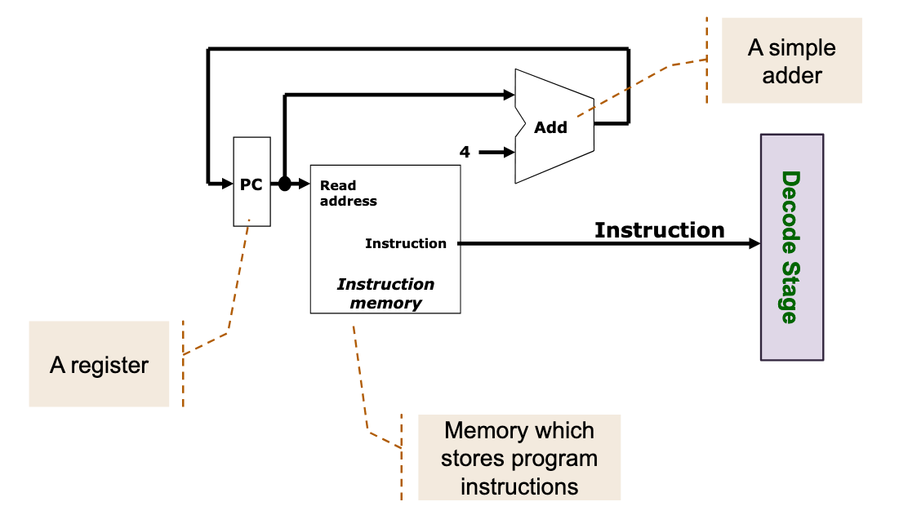

# MIPS Instruction fetch / IF Stage

## Overview

Gets instruction from memory.

Instruction address is stored in program counter (PC) register.

## Block diagram

## Components

<50ca8d59>

<381c6874>

## Misc

In the above diagram, it appears the PC is being read and updated at the same time. How can it works properly?

<c170a1b4>
