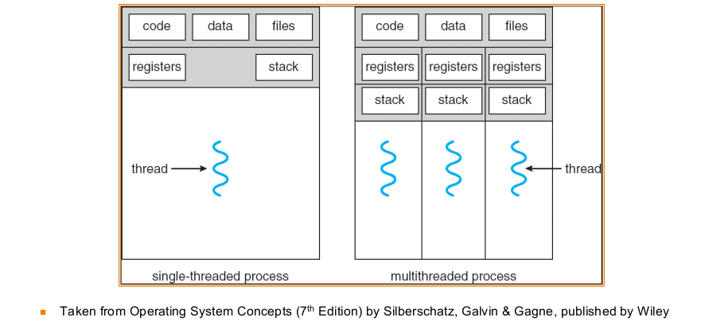

# What are the differences between threads and processes?

- A single process can have multiple threads.

## Shared stuff for threads (within same process)
- <23ccdc7e>: Text, Data, Heap
- <6d613b04>: Process id, files etc...
  
## unique stuff threads (within same process):
- identification (thread id)
- registers (general purpose and special)
- Stack
