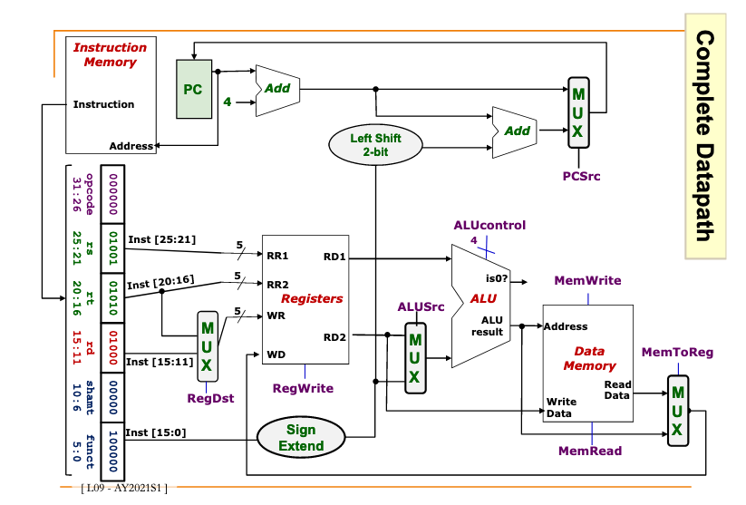
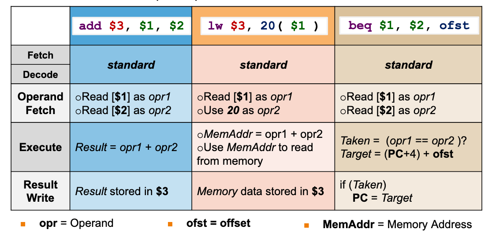
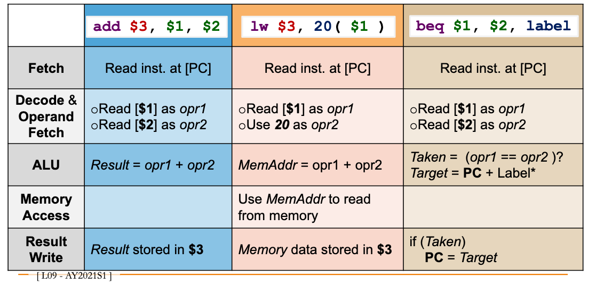

# Instruction execution stages / cycle

*Complete diagram with all stages*

## In order:

<ded5c828>

<5fc9a159>

<8eed124e>

<7672f0dd>

<4f973a42>

## Example:

## They are actually split into the following stages in MIPS:

<5fc9a159> and <8eed124e> are merged into 1 stage.

<7672f0dd> is split into 2 stages: <c7317dfc>  <185c1066> .

## Results in the following 5 stages (in order):

<ded5c828>

<5fc9a159> + <8eed124e> 

<c7317dfc>

<185c1066>

<4f973a42>

## Example:

