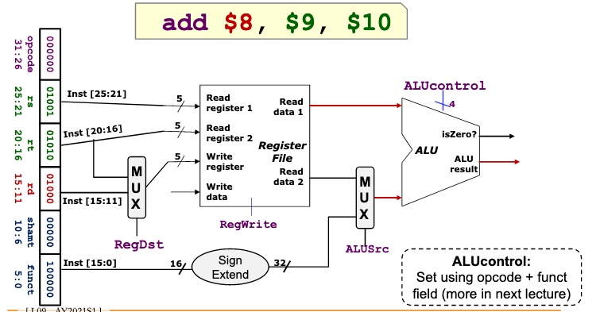

# MIPS ALU: handling Non-branch instructions

Take Read data 1 (RD1) and Read data 2 (RD2),

These are 32-bit signed, (1-word)

perform the operation on them, return:

1. result 

2. result == zero
