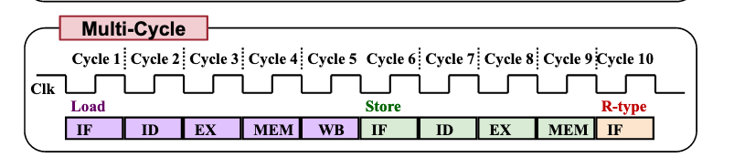
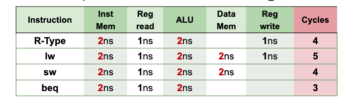

# MIPS multi-cycle

Break instructions into **execution steps**:

1. <ded5c828> 
2. <5fc9a159> + <8eed124e> 
3. <c7317dfc> 
4. <185c1066> 
5. <4f973a42> 

## Example

- Choose the longest stage time = 2ns

- Executing 100 instructions with a given average cycle per instruction (CPI) of 4.6

  100 * 4.6 * 2ns = 920ns (note this is longer than the <8da72825> )
