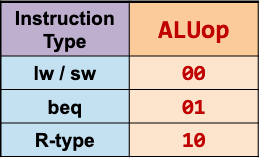
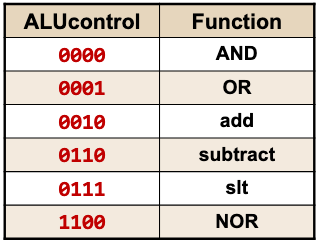
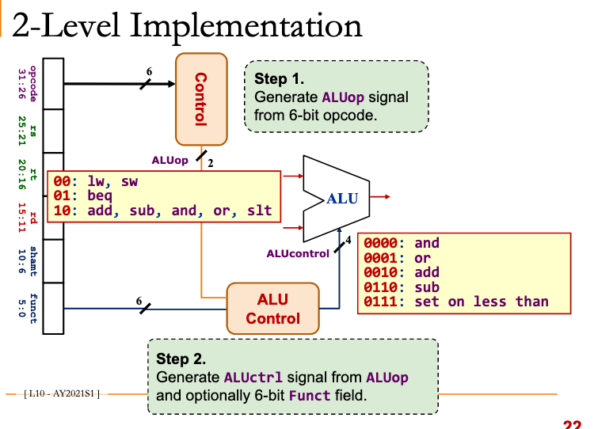
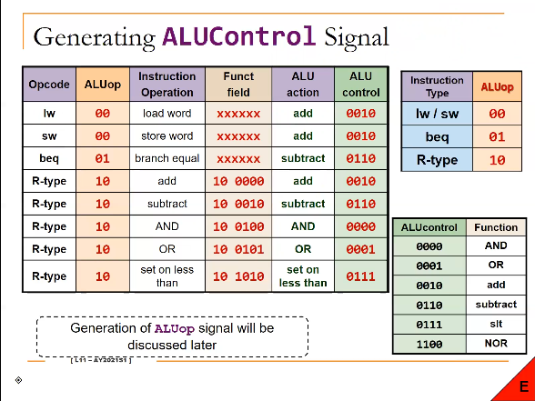
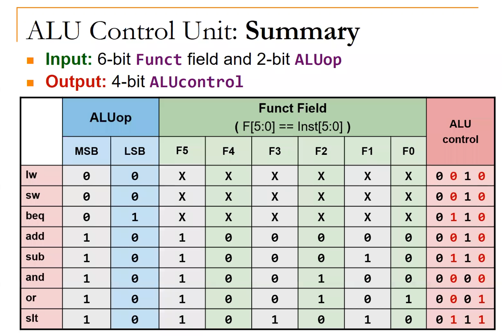
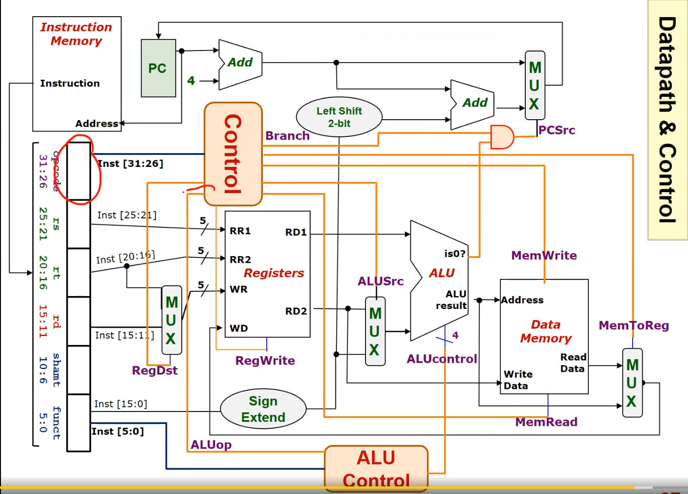

# MIPS ALU Multilevel decoding

The above diagram classifies instructions into different sets.

With ALUop (2-bits instead of 6-bit opcode),

and the function code, we can generate 4-bit ALUcontrol signal.

*Implementation diagram*

*Generating Alu Control Signal*

*Summary*

*Design*

