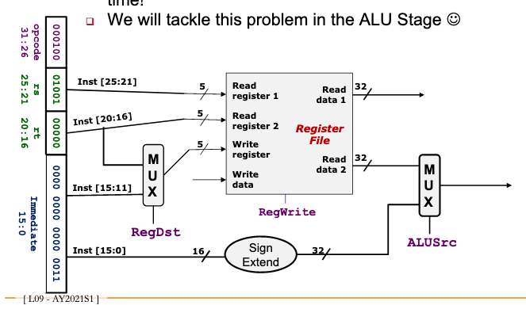

# MIPS decode branch instruction

For branching we need to calculate:

1. Branch outcome, does that register cause branching?

2. Where does it branch to?

Instead of just one outcome like in [[4ea82e49]]  and [[2355011b]] .

We shall see how this can be done in the [[c7317dfc]] stage.

